# Business card design experiments

10 visually distinct concepts for the same business card content (Igors
Volohovs, Software Engineer, AI Integration / Computer Vision / Robotics),
rendered with the same pipeline as `../generator` (Jinja2 + Playwright
screenshot at 1119x615). These are **explorations to choose from**, not a
replacement for the production card in `../generator` or the repo root
`front.png`/`back.png` - nothing there was touched.

## Layout: front = intro, back = QR

Following design feedback, the card content is now split across both sides:

- **Front**: name, title, contacts, tags, a real photo, and a short
  variant-flavored CTA line (e.g. "Portfolio on the back", `// portfolio ->
  flip card`, "SEE SHEET 2 / PORTFOLIO") - no printed URL, since a URL next
  to a QR code that encodes the same URL is redundant.
- **Back** (previously blank): a single centered QR code with a
  "portfolio" caption underneath (case adapted per variant - e.g. all
  caps for blueprint/corporate, lowercase for terminal/robotics), styled
  per-variant (background, font, frame) via a shared template so all ten
  stay visually consistent with their front.

**The photo.** The brief was explicit: use a real photo of Igor or flag it
and fall back gracefully - never fabricate or substitute a generic image.
Two real candidates existed: `me.png` already in this repo, and
`https://igorsvolohovs.github.io/image.png` from Igor's live portfolio site
(verified genuine by cross-checking the phone/email/GitHub details embedded
in that site's own HTML against the card's contact info). The portfolio
photo was used as the primary (`experiments/assets/photo.png`) since it's
already the public-facing one; `me.png` is the readily available fallback
if a different photo is preferred.

The photo started out sized like a small avatar (~220-256px) in most
variants, which read as an afterthought rather than a real design element.
It went through two enlargement passes - a first pass, then a second after
Igor flagged QR Centerpiece's circular photo specifically as "still too
small for how good the composition is" - and now dominates each layout:
up to 380px square, a 460px circle in QR Centerpiece, or a full-height
450x535 portrait in Minimal. Getting there needed real layout changes in
several templates (narrower text columns, a smaller name in Big Type,
tighter padding in Robotics, a narrower gap in QR Centerpiece), not just a
bigger CSS number. Every crop stays at or below the source photo's native
640x640 resolution, so nothing is upscaled past what the source can
support.

Every QR code encodes `https://igorsvolohovs.github.io/` and was verified
to decode correctly (OpenCV `QRCodeDetector`). A few early color choices
(green-on-dark, white-on-dark) looked thematically nice but failed to
decode reliably even at high contrast, so every variant uses a plain
black-on-white QR image, framed to fit its own theme on the back - a scan
failure isn't a style worth risking on an actual business card.

**Print-size check.** A QR that decodes fine on a full-resolution digital
screenshot can still be too small to scan on an actual printed card held at
arm's length (~15-30cm) - phones need roughly 15-20mm of QR width and
~0.3-0.4mm per module at that distance. Now that every variant shares one
QR block on the back (instead of ten different front-side treatments), the
size is uniform across the board. Assuming the card prints at 90x50mm (the
size already used in this repo's `print.css`, 1119x615px -> 12.43px/mm):

| | Value |
|---|---|
| QR size (print) | 20.9mm |
| Module size | 0.57mm |
| Decode check (all 10) | OK |

Comfortably above both safe thresholds, and identical for all ten variants
since the QR now lives on a shared back template.

**Minimum text size.** All on-card text (down to the smallest label/tag) is
now at or above 30px, which at the 90x50mm print scale works out to roughly
6-7pt - the smallest still-legible size for print, per the same brief.

Run `python render_all.py` (from this directory, using `../generator/.venv`
or your own with `../generator/requirements.txt` installed) to regenerate
everything.

---

## 1. Minimal

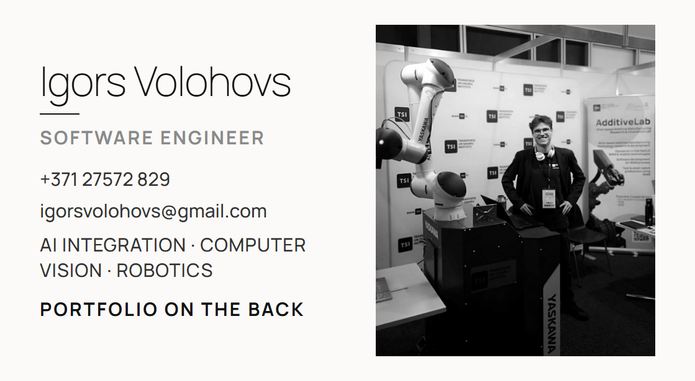
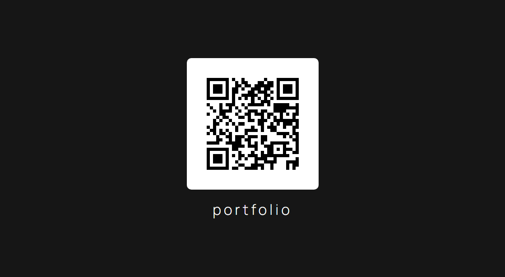

Thin, airy, monochrome. Huge whitespace, a single hairline rule under the
name, small caps for the title, tags reduced to a quiet dotted list. No
color at all - the confidence is in the restraint. The photo sits
grayscale on the right as the one strong secondary shape the layout needs;
the QR moved to a plain lowercase-caption back panel that keeps the same
quiet, minimal tone.

## 2. Geometric / asymmetric

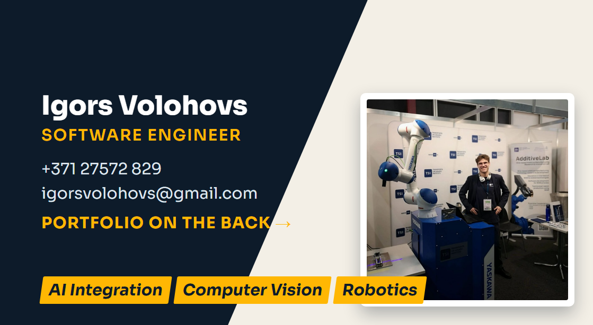
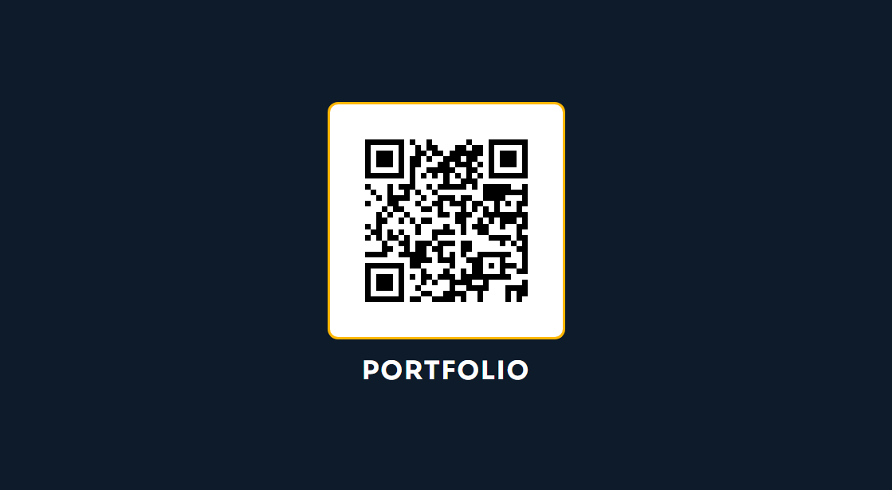

A diagonal cut replaces the usual straight panel divider, with a thin amber
sliver between navy and cream. Bold, angled tag chips give it real motion
instead of a static two-column layout. A framed photo now sits low in the
widest part of the cream triangle, where the QR card used to be; the QR
itself moved to the back, framed with the same amber accent ring.

## 3. Terminal

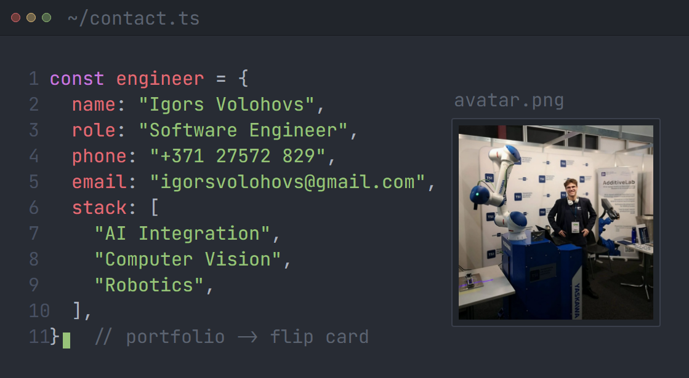
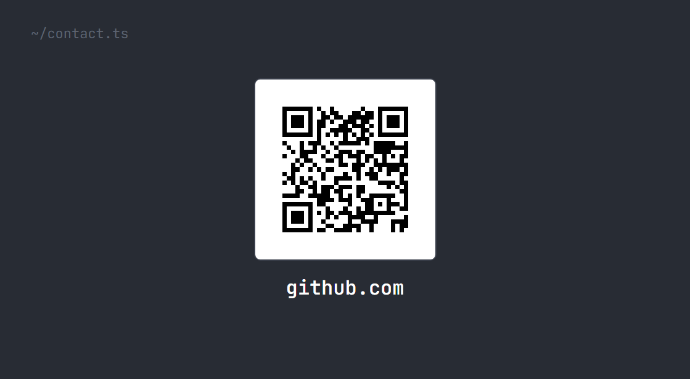

The whole card is a fake code editor window (title bar, traffic-light
dots, `~/contact.ts`), contact info rendered as a syntax-highlighted object
literal with line numbers, a `stack: [...]` array for the tags, and the CTA
as a trailing `// portfolio -> flip card` comment. The most literal
"software engineer" concept of the ten. The old QR preview-pane became an
`avatar.png` preview pane showing the real photo instead; the QR itself
now lives on the back inside the same editor-chrome palette.

## 4. Neon gradient

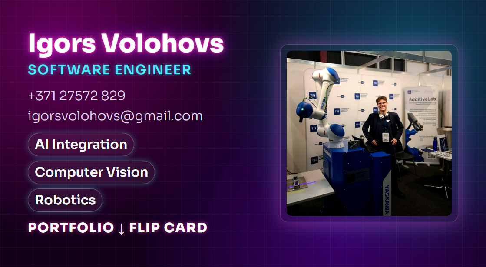

Dark background, a magenta-to-cyan gradient mesh, a subtle grid, and a
glowing name with neon text-shadow. Pill-shaped tags with soft outer glow
and a frosted-glass photo panel (contrast/saturation boosted to match the
neon palette) where the QR used to sit. The QR itself now lives on the
back behind the same glowing gradient mesh and glass-panel frame. AI-startup
energy without going full cyberpunk kitsch.

## 5. Big type

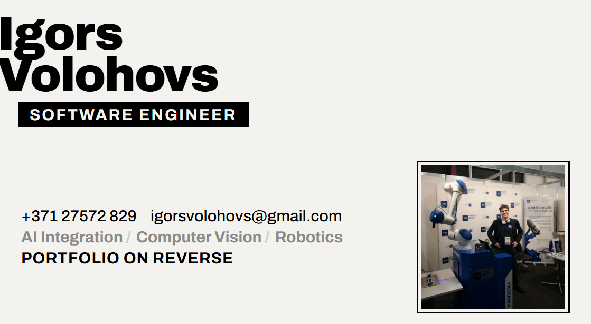
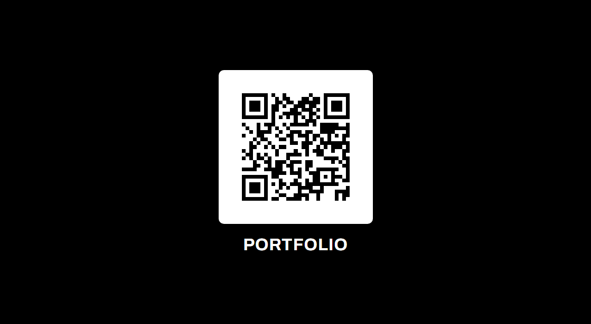

The name *is* the card - two lines of black display type bleeding off the
left edge, a small stamped title badge underneath. The bottom strip now
holds a bordered photo block instead of the old QR corner icon. Maximum
confidence, minimum decoration; the QR moved to a plain black back page
with the same bold sans caption.

## 6. QR centerpiece

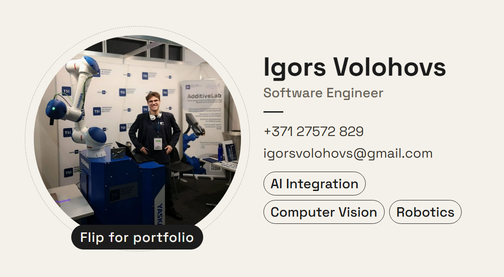

No side panel at all - one continuous cream background, and a circular
photo (with a dashed orbit ring) is now the visual anchor where the QR used
to sit, with a badge carrying the CTA text ("Flip for portfolio") instead
of "scan me". The QR itself moved to the back as a clean centered block -
still true to the variant's original photo/QR-as-hero idea, just split
across both sides of the card now.

## 7. Accent color

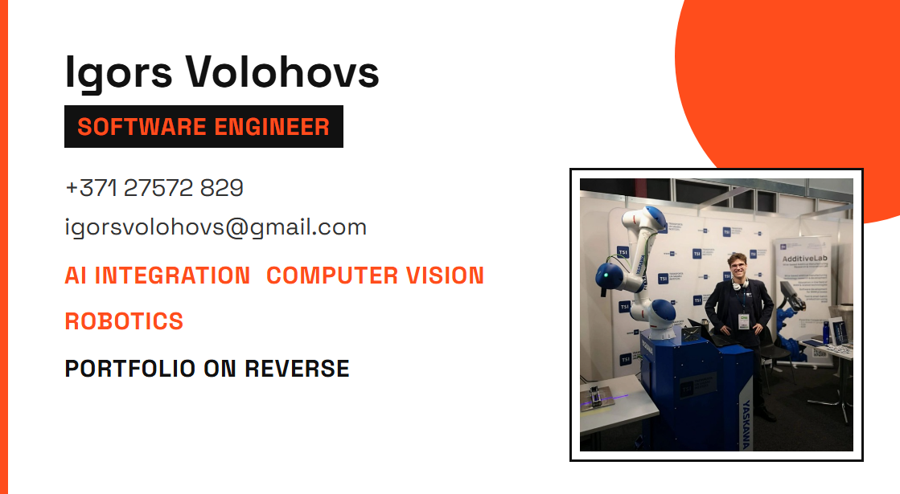
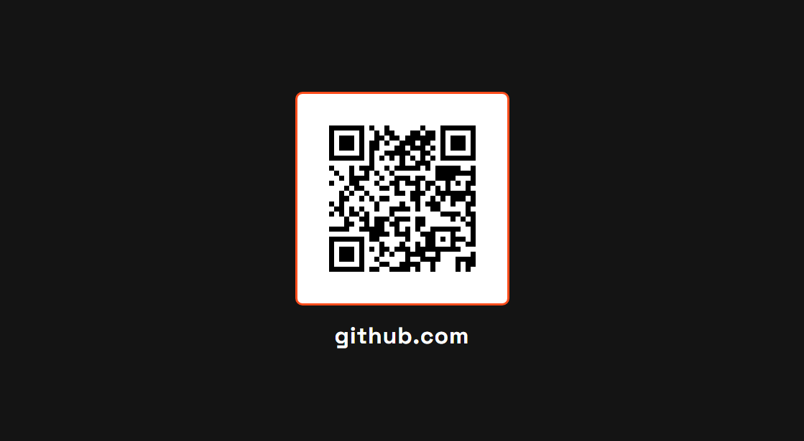

White canvas, one bold accent color (orange) used sparingly: a corner
circle, the title badge, the tag labels. Swiss/Bauhaus-influenced,
everything else stays black text on white. The framed photo sits
bottom-right where the QR card used to be; the QR itself now lives on the
back inside a matching orange-bordered frame.

## 8. Corporate

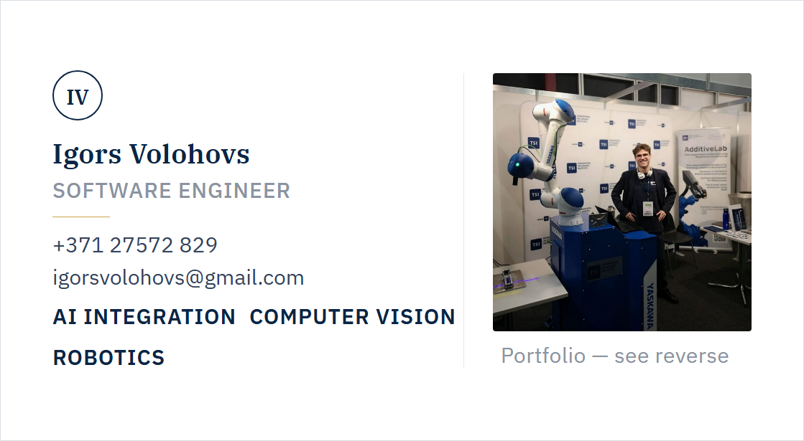

Formal: a monogram roundel, serif name, a thin gold rule, letter-spaced
title. Included deliberately as the conservative counterpoint to the
bolder variants - the one to hand to a board member. Two-column layout
(content left, photo + CTA right, thin rule between), a common formal-
letterhead pattern. The QR moved to a plain, serif-captioned back page
matching the deep-navy corporate palette.

## 9. Robotics / CV

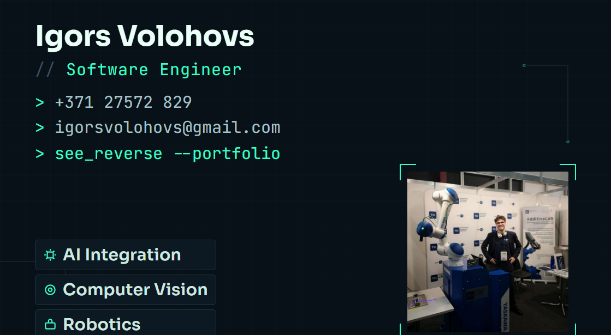
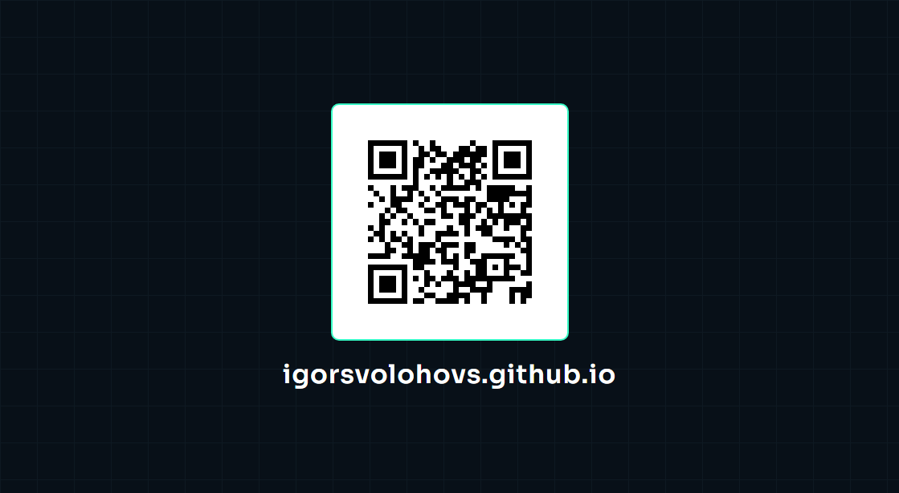

Dark background with a faint circuit-trace pattern and PCB-style node
dots, monospace `> ` prompts for contact lines and the CTA, and the three
tags stacked vertically as badges with hand-drawn AI-chip / camera-lens /
robot-arm icons. The photo sits inside a viewfinder-bracket frame, like a
targeting reticle, where the QR used to be. The QR itself now lives on the
back with the same circuit-grid backdrop and bracket-style frame.

## 10. Blueprint

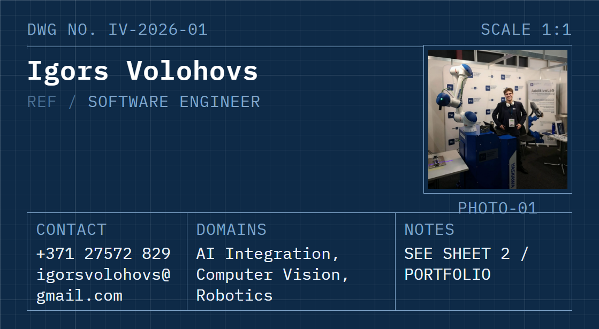
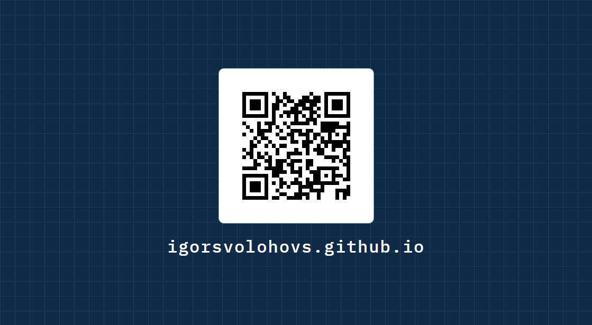

An engineering technical-drawing pastiche: graph-paper grid, a dimension
line under the name, and the contact/tag info laid out as a real drafting
title block (now three columns - Contact / Domains / Notes - since the
Repository/URL column was removed). The photo is labeled like a schematic
part ("PHOTO-01") where the QR component used to sit. The QR itself moved
to the back, still framed and captioned in the same drafting style.

---

Notable bugs found and fixed along the way (both from this round and the
earlier QR-sizing pass):

- **Flex-stretch title bar** (variant 5): `display: inline-block` on a flex
  child does *not* override the parent's default `align-items: stretch` -
  the title badge was stretching to the full card width until it got an
  explicit `align-self: flex-start`.
- **Grid painting over the QR** (variant 10): two `position: absolute`
  siblings with no explicit stacking order let the background grid line
  render on top of part of the QR/photo component; fixed with an explicit
  `z-index`.
- **Border-radius blob** (variant 6 back): applying an extreme
  `border-radius` (`999px`, meant for a circle) to a QR frame that isn't
  perfectly square produced a stadium/blob shape instead of a circle -
  removed the override in favor of the shared template's normal rounded-
  square frame.
- **Header/photo collision** (variant 10): the enlarged photo block
  initially overlapped the "SCALE 1:1" header text in the top-right corner;
  moved it down to clear the header row.
- **CTA double-prefix**: two templates (terminal, robotics) render their
  own `// ` / `> ` prefix in CSS *and* had it baked into the CTA string,
  producing a doubled prefix - fixed by keeping the prefix only in the CSS.
- **Tags running behind the photo** (variant 7, after enlarging the photo):
  the tag row had no `max-width`, so growing the absolutely-positioned
  photo panel didn't shrink the text's available width - the flex-wrap
  never triggered and "Robotics" rendered half-hidden under the photo.
  Fixed by capping the tag row's width so it wraps before reaching the
  photo's left edge.
- **Photo/titleblock collision** (variant 10, after enlarging the photo):
  a bigger photo pushed its "PHOTO-01" caption down into the drafting
  title block's "NOTES" header. Fixed by trimming the photo a bit and
  raising it slightly to restore clearance on both sides (the "SCALE 1:1"
  header above, the title block below).
